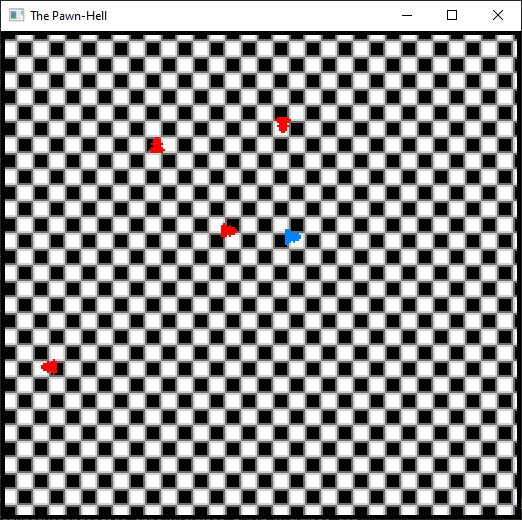

# The Pawn-Hell

Author: Alan Lee / soohyun3

Design: This is a bullet hell game but you are a chess king trying to survive incoming bullet-pawns.
        This game tries to make use of limited hardware to implement bullet-hell type of resource management and collision detection.

Screen Shot:

How Your Asset Pipeline Works:

My [asset generator](asset_generator.cpp) firstly creates the binary data to be used for loading sprites during runtime.

This script takes in the source png files (such as the [background](assets/Chessboard.png) or the [king](assets/King.png)),
loads them through [load_png function](load_save_png.cpp) and saves the color data as a vector of glm::u8vec4.

... do I need to convert the vector into an array of chars somehow? ...

Based on the type sprite that is being loaded, different "magic number"s are assigned for `write_chunk` operations
that store these data into a binary file.

Having made these data, now the [asset loader](asset_loader.cpp) sets up relevant palettes, tiles, sprites, and so on for the game to use.

(TODO: describe the steps in your asset pipeline, from source files to tiles/backgrounds/whatever you upload to the PPU466.)

(TODO: make sure the source files you drew are included. You can [link](your/file.png) to them to be a bit fancier.)

How To Play:

Press any combination of the four direction keys to move towards Left/Right/Up/Down/Diagonal directions.

(TODO: describe the controls and (if needed) goals/strategy.)

This game was built with [NEST](NEST.md).